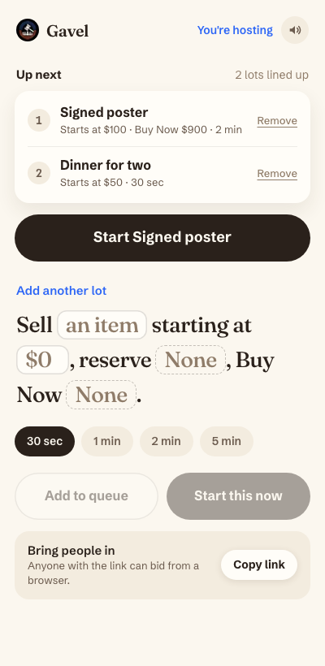
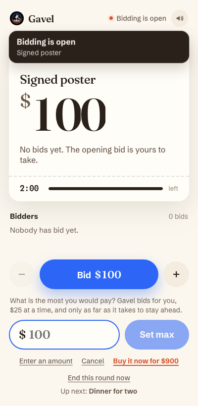
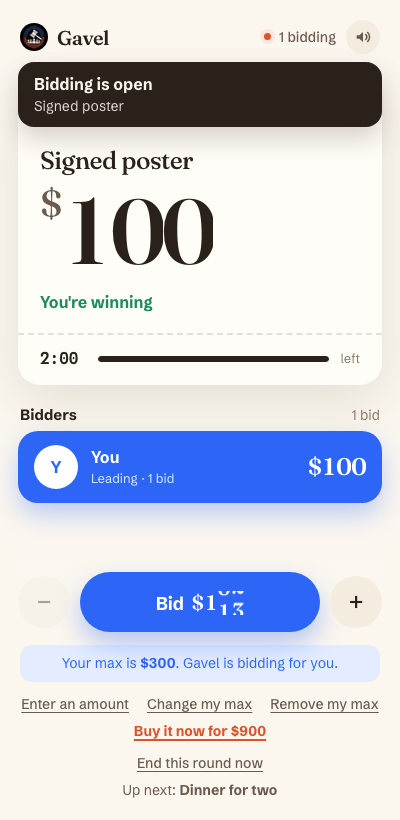
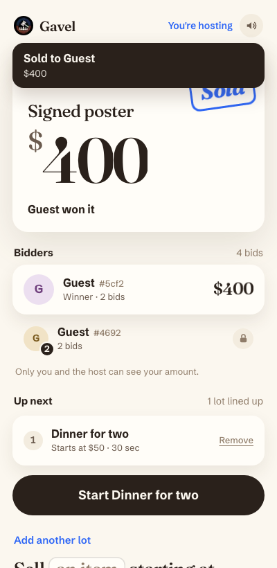
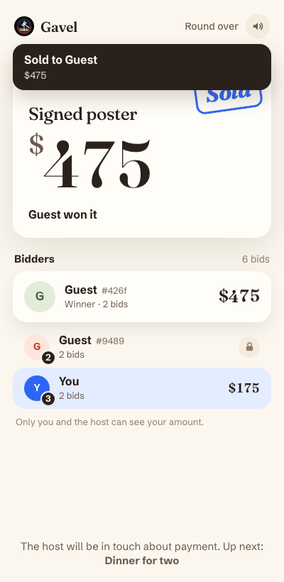
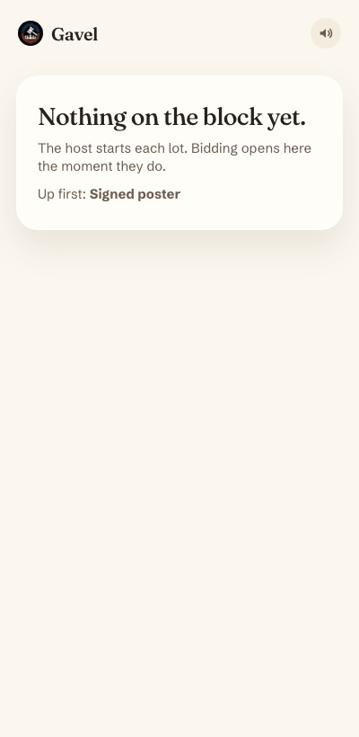

# Zoom Gavel

Live auctions inside a Zoom meeting. The host opens Gavel from the Zoom Apps
panel, puts an item up, and everyone in the meeting bids in real time from a
side panel, without leaving the call. People outside the host's Zoom account
join from a browser link and bid the same way.

Built by Sankritya Thakur for the ASU Next Lab x Zoom fellowship
(Aug 27 to Dec 1, 2026).

- Live site: https://zoomgavel.vercel.app
- The in-meeting panel: https://zoomgavel.vercel.app/zoom-test
- Stack: Next.js 16, React 19, Zoom Apps SDK, Supabase Postgres + Realtime, Vercel

## What it does today

For the host:

- **Start a lot the way you would say it.** "Sell a signed poster starting at
  $100, reserve None, Buy Now $900", pick a round length, start.
- **Queue multiple items.** Line items up ahead of time and start the next one
  with a single tap.
- **Run the clock.** A server-side countdown that extends when a bid lands in
  the closing seconds, so nobody wins by sniping.
- **Results and export.** Every finished round is saved. The host sees a
  running receipt and can download a CSV of winners and prices to collect
  payment.
- **Bring people in.** One button invites the whole meeting; a copyable link
  lets anyone bid from a browser.

For bidders:

- **One-tap bidding** with a quick bid button, plus and minus steps, or a
  typed amount.
- **Max bid.** Set the most you would pay and Gavel bids for you in $25 steps,
  only as far as it takes to stay ahead.
- **Buy Now.** If the host set a Buy Now price, the first person to take it
  wins instantly.
- **Live leaderboard with private bids.** Everyone sees the ranking and the
  current price; each bidder's own amount is visible only to them and the host.
- **Alerts and sound cues.** A banner and a sound when you are outbid, when a
  lot opens, when the clock runs low, and when the item sells. Mute button in
  the header.

Under the hood:

- **Real time.** Bid to screen in about 160 to 370 ms, measured on production.
- **Race-safe.** Bids are accepted atomically in Postgres; two people can never
  both win.
- **Verified identity.** Zoom tells the server who each person is and who the
  meeting host is; only the host can run rounds in their meeting.
- **Tested.** A 133-assertion concurrency and security suite runs against the
  live site (bid storms, simultaneous Buy Now, forged identity, privacy of bid
  amounts, max-bid contests, the queue).

## Screenshots

| Host: items queued | Bidder: setting a max | Bidder: max bidding for them |
|---|---|---|
|  |  |  |

| Host: sold, next item ready | Bidder: round over | Bidder: waiting for the first lot |
|---|---|---|
|  |  |  |

## Progress so far

- **Foundations.** Zoom App running inside a meeting, meeting identity, shared
  session per meeting, marketing site.
- **Real time in Zoom.** Live updates inside the Zoom client over a
  server-sent event stream, with automatic fallbacks.
- **Backend hardening.** Atomic bids, anti-snipe clock, verified host from the
  Zoom webhook, rate limits, session expiry, the race test suite.
- **Panel redesign.** Price-tag lot card, receipt-style results, rolling
  numbers, and a leaderboard whose rows move as the order changes.
- **Week of Sep 28.** Leaderboard with private bids, Buy Now price, auction
  results with CSV export.
- **Week of Oct 5.** Queue multiple items, max bid, outbid alerts and sound
  cues.

## Status and what is next

- The app is a development app on the Zoom Marketplace. It opens inside
  meetings hosted by the developer account; everyone else bids from the
  browser link. Publishing to the Marketplace is what lets anyone add it.
- Tested end to end in a real Zoom meeting once (Oct 2). The Oct 5 week's
  features are verified by automated tests and browser runs on the live site,
  and still need a pass inside a real meeting, sounds especially.
- Not built yet: payment inside the app (winners pay the host outside it),
  co-hosts running rounds, verifying browser bidders, Marketplace submission.

## Local setup

Requirements: Node.js 24 or newer, npm 11 or newer.

```bash
npm install
npm run dev
```

Open `http://127.0.0.1:5173/zoom-test`. In a normal browser the panel runs as
a sandbox session where anyone can host, which is the easiest way to try it.
Add `?session=<any-name>` to share one session between several browser
windows.

## Test inside Zoom

See `docs/in-meeting-test.md` for the runbook (written before the panel
redesign, so some on-screen labels it quotes have changed). The Marketplace app is a
General App with the Zoom App surface:

- Home URL: `https://zoomgavel.vercel.app/zoom-test`
- Scopes: `zoomapp:inmeeting`, `meeting:read:meeting`
- In-client features: Collaborate Mode, Guest Mode
- Event subscription: `meeting.started` to `/api/zoom/webhook`
- Zoom App SDK APIs: `getRunningContext`, `getUserContext`, `getMeetingUUID`,
  `getAppContext`, `startCollaborate`, `onCollaborateChange`,
  `onRunningContextChange`

Add it to your Zoom account with the Marketplace **Local Test** flow, start a
meeting on that account, and open Gavel from Apps. For local development
inside Zoom, point the Home URL at a tunnel to port 5173 instead (Zoom does
not accept `localhost`).

## The panel

`/zoom-test` is the in-meeting panel: the lot as a price tag, a leaderboard,
one bid button with a max-bid control, alerts with sound, and for the host a
setup sentence, the queue of lots, and a receipt of finished lots. The SDK diagnostics that used to fill the page are behind
`/zoom-test?debug=1`.

## Live auction architecture

State lives in Supabase Postgres: one `auction_sessions` row per session
plus an `auction_bids` ledger (see `supabase/migrations/`). All writes go
through service-role SQL functions; clients read through the API.

Push transport, as a ladder. Browsers subscribe to Supabase Realtime
directly. Inside the Zoom client (whose webview WebSocket support and
domain allow list are not ours to control) the panel uses Server-Sent
Events from our own origin: `GET /api/session/[key]/stream` holds one
Realtime channel per session per server instance, forwards sanitized
`session` / `bid` deltas after a viewer-specific `state` snapshot, and ends
each stream at 270s so EventSource reconnects well inside the 300s
function limit. Any failure drops a rung (realtime to SSE to 1s polling).
The diagnostics view (`?debug=1`) names the transport in use (`live`,
`live stream`, or `1s polling`) and has a transport probe that
reports whether WebSocket, EventSource, and a raw Supabase wss handshake
work in the current client. Functions are pinned to `pdx1` in
`vercel.json`, next to the Supabase project in us-west-2: every bid is
several sequential database calls, and running them cross-country tripled
bid latency. Measured on production, bid to screen on the SSE path is
160 to 370 ms.

Rounds. A session is `idle` until the host starts a round, which sets the
item, opening bid, optional reserve, and a server-side `ends_at`. Bids are
accepted atomically under a row lock: the first bid may equal the opening
price, later bids must beat the leader, and a bid landing inside the
closing window pushes `ends_at` out (anti-snipe, never backwards). Expired
rounds close lazily on the next read or bid, so realtime subscribers see
the terminal row. Ceiling is $1,000,000 in the API and in SQL.

Buy Now. A round may carry an optional Buy Now price (above the opening
bid, never below the reserve). A bid at or above it is accepted at exactly
that price and closes the round inside the same locked transaction as any
other bid, so simultaneous buyers cannot both win: the rest find the round
closed.

Leaderboard with private bids. Clients never receive the bid ledger. They
get one leaderboard entry per bidder, ranked, with a bid count. An amount
is included only for the viewer's own entry (verified identity), for every
entry when the viewer is the host, and for the leader, whose amount is the
public current price. Pushes carry ranks only; the panel fills in the
viewer's own amount, which an unverified bidder's browser remembers for
itself because the server cannot tell anonymous viewers apart. The limit
of this is inherent to an open ascending auction: someone watching live
sees each new current price and who set it.

Max bids. A bidder may set a ceiling for the round (`POST
/api/session/[key]/max`). After every bid or ceiling change the server
resolves the contest inside the same transaction, the way a live auction
would: the highest ceiling leads at one $25 step above the runner-up's
ceiling, never above its own, and a tie stays with whoever led. Automatic
bids are marked as such in the ledger. A ceiling is private: a verified
bidder gets their own back from the server, an unverified bidder's browser
remembers it, and nobody else ever sees one.

Lot queue. The host lines up lots in advance (`/api/session/[key]/queue`,
up to 30) and starts the next with one call that pops it and opens the
round atomically. Only the host can read or change the queue; everyone else
sees just how many lots are waiting and the name of the next one.

Alerts and sound. The panel raises a banner and a sound when the viewer is
outbid, a lot opens, the clock enters its last stretch (with a tick for each
of the final five seconds), and the hammer falls. Sounds are synthesized
with Web Audio, so there is nothing to download and nothing for the Zoom
client's allow list to block. The mute choice is remembered per browser.

Results. A trigger writes one `auction_rounds` row whenever a round stops
being open, whichever path closed it (expiry, host stop, Buy Now, or the
next round starting over an expired one). `GET /api/session/[key]/results`
returns them as JSON, or as a CSV with `?format=csv` for collecting payment
outside the app. Cells that would run as spreadsheet formulas are
neutralized. On meeting sessions only the host may read results.

Identity. Zoom sends `x-zoom-app-context` on the Home URL request;
`src/proxy.ts` decrypts it (AES-256-GCM, strict tag length) and issues a
signed `gavel_ctx` cookie. That header proved unreliable in a real meeting
(the panel loaded several times with no identity), so the panel also asks
the Zoom client for the same signed token with `zoomSdk.getAppContext()`
on every open and every 30 minutes, and trades it at `POST /api/identity`
for the same cookie. The cookie is `SameSite=None; Partitioned`, needed
because the Zoom web client embeds the app cross-site. API routes trust
only that cookie. Verified bidders are stored as HMAC keys, never raw Zoom ids, since
the tables are publicly readable. Join-link and browser users bid as
`unverified`.

Host authority. Meeting sessions (`mtg-` keys) require a verified identity
from that exact meeting. Zoom's app context carries no role, so the real
host comes from the `meeting.started` webhook (`POST /api/zoom/webhook`,
signature and timestamp checked): it stores HMAC(host_id) as the session's
verified host, and from then on only that identity can start or stop
rounds, enforced in SQL. When no webhook has arrived, the first verified
user to start a round claims host. Either kind of claim lapses after two
idle hours, since the webhook names the meeting owner, who is not always
the person running it (alternative hosts).
Sandbox sessions (demo and join-link keys) are ownerless so anyone can run
the clock, which is what the concurrency tests rely on.

Security model, verified by review and black-box testing. The public anon
key cannot read or list any table (reads go only through the API, which
requires a session key) and cannot call any SQL function. Realtime uses
private per-session broadcast topics fed by triggers, so you can receive
a session's updates only if you already know its key. POST routes reject
cross-origin browser requests and non-JSON bodies (the identity cookie is
SameSite=None because the Zoom web client embeds the app). Every displayed
name carries a server-derived `#xxxx` key suffix, since names are
client-chosen even for verified bidders. Session broadcasts replace
`host_key` with a presence marker, so a session key does not reveal which
bids are the host's.

Rate limits live in Postgres (fixed windows via `rate_limit_hit`) so they
hold across serverless instances: bids 120 per 10s per IP and 10 per 5s per
bidder per session, round start/stop 60 per minute per IP, init and stream
connects 120 per minute per IP. Exceeding one returns 429 with
`Retry-After`. A limiter error fails open.

Expiry. A pg_cron job (`gavel-expire-sessions`, hourly) runs
`expire_sessions()`: demo and join-link sessions are deleted 24h after
their last activity, meeting sessions after 30 days, never while a round
is live. Stale rate-limit buckets go with them.

Testing. `BASE_URL=http://127.0.0.1:5173 npm run test:race` runs the
concurrency suite (bid storms, identical amounts, expiry boundary,
colliding extensions, host stop vs in-flight bids, validation, rate
limits, SSE push latency, the Buy Now race, results and CSV export, max-bid
contests, the lot queue). Add
`SESSION_SECRET=<server value>` to also run the host-rule, forged-cookie,
and bid-privacy scenarios with minted cookies, and
`ZOOM_WEBHOOK_SECRET_TOKEN=<server value>` for the webhook-verified host
scenario. The suite itself counts against the per-IP round limit, so wait
a minute between back-to-back runs.

Environment: `NEXT_PUBLIC_SUPABASE_URL`, `NEXT_PUBLIC_SUPABASE_ANON_KEY`,
`SUPABASE_SERVICE_ROLE_KEY`, `SESSION_SECRET`, `ZOOM_CLIENT_SECRET`
(the Development app's secret for the tunnel, the Production app's for
Vercel Production), and `ZOOM_WEBHOOK_SECRET_TOKEN` (the app's event
subscription Secret Token; the webhook answers 503 without it).

Known gaps, tracked deliberately for later phases: co-hosts cannot run
rounds, payment is collected outside the app (no checkout), browser bidders
are unverified, and the app is not yet published on the Zoom Marketplace.

## Commands

```bash
npm run dev        # Next.js development server on port 5173
npm run lint       # ESLint
npm run typecheck  # TypeScript validation
npm run build      # Next.js production build
npm run start      # Run the production server on port 5173
```

## Security notes

- Never place a Zoom client secret in a `NEXT_PUBLIC_*` variable. Next.js exposes those values to the browser bundle.
- Host-only auction actions are verified server-side: identity from the decrypted Zoom app context, host role from the signed `meeting.started` webhook.
